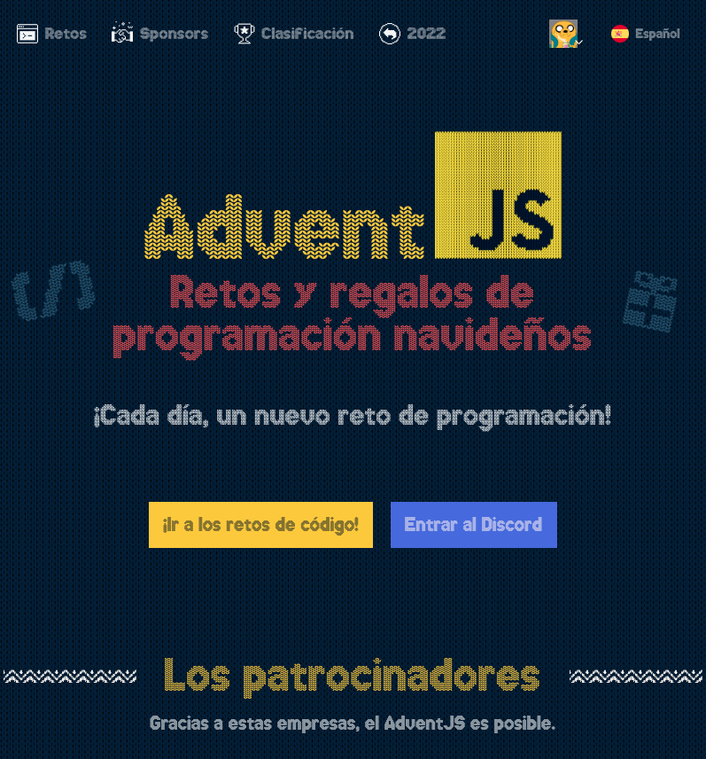

# AdventJS-2023

## Retos y regalos de programación navideños

### ¿Qué es un adviento?

Aunque tiene sus raíces en la religión católica, el adviento se ha convertido en una tradición donde los niños conseguían chocolate por 4 semanas, uno por día, del 1 al 24 de diciembre. Aquí lo adaptamos a retos de programación.

**Yeah Yeah Hermano!**
